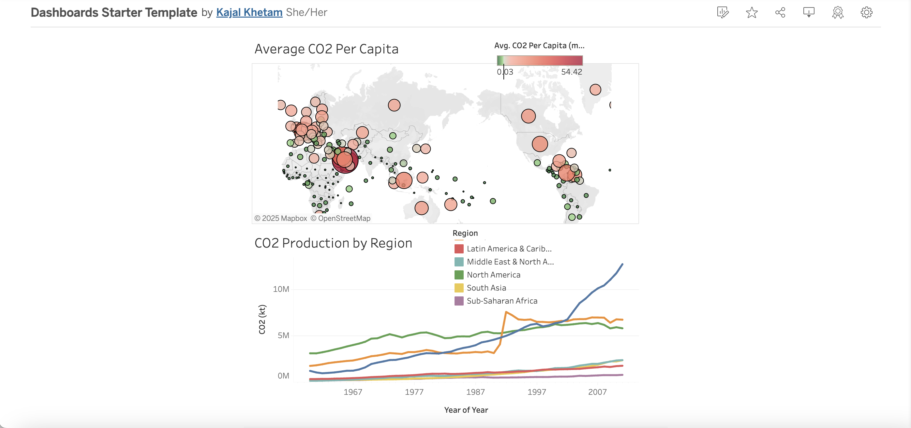

# co2-production-analysis-tableau
CO2 Production by Region, Average CO2 Per Capita

## Project Overview
Interactive Tableau dashboard analyzing co2 production by region, average co2 per capita.

## 🎯 Objectives
- Analyze co2 production by region, average co2 per capita.

## 📊 Dashboard Features
- **Population Overview**: Display co2 production by region.
- **Population by Country**: Interactive tooltips with co2 production, and % of world total.
- **Growth Trends Over Time**: Option to filter Average CO2 Per Capita and CO2 Production by Region.

## 🛠️ Tools & Technologies
- **Tableau Public**: Data visualization and dashboard creation
- **Data Source**: [Excel/CSV]
- **Data Cleaning**: [Excel]

## 🔗 View Dashboard
**[→ View Interactive Dashboard on Tableau Public](https://public.tableau.com/shared/XSQ7P3YJT?:display_count=n&:origin=viz_share_link)**

## 📸 Dashboard Preview

## 📁 Project Structure
population-analysis-tableau/
├── README.md                  # Project documentation
├── data/
│   ├── co2.csv          # Original dataset
│   └── data_dictionary.md    # Data field descriptions
│   └──co2.png # Screenshot of dashboard

## 📊 Data Overview
- **Key Metrics**:  analyzing co2 production by region, average co2 per capita.

## 🔍 Analysis Process
1. Data collection and cleaning
2. Exploratory data analysis
3. Dashboard design and development
4. Testing and validation
5. Publishing to Tableau Public

*This project is part of my Data Analyst portfolio showcasing data visualization and business intelligence skills.*
